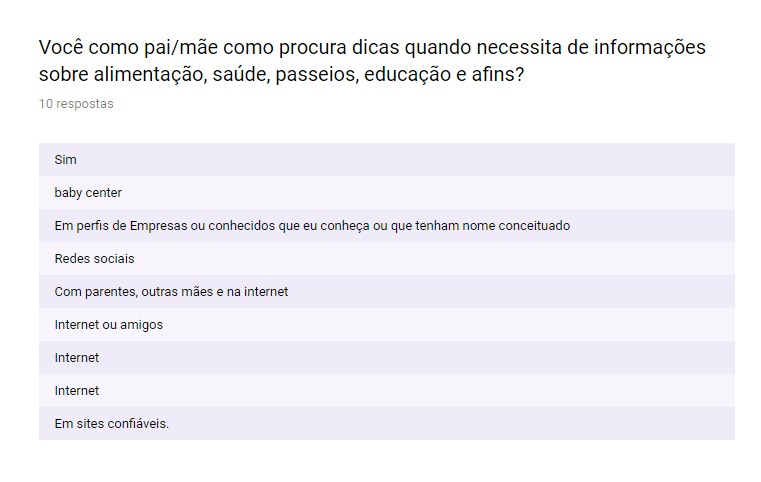
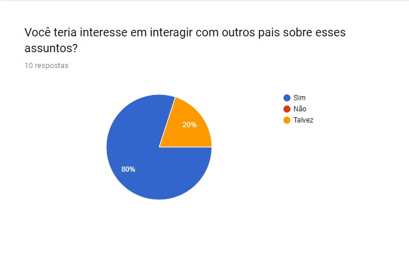
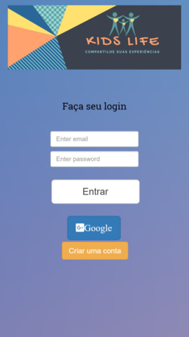
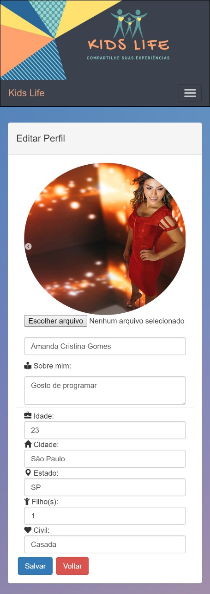

# Data Lovers

## Índice
* [Preâmbulo](#preâmbulo)
* [Resumo](#resumo-do-projeto)
* [Definição](#definição-do-produto)
* [Histórias](#histórias-de-usuário)
* [Protótipo](#protótipo)
* [Produto](#produto-final)
* [Checklist](#checklist)

# Criando uma Rede Social

## Preâmbulo

Instagram, Snapchat, Twitter, Facebook, Twitch, Linkedin, etc. As redes sociais invadiram nossas vidas. Nós as amamos ou odiamos, e muitas pessoas não conseguem viver sem elas.

Há redes sociais de todo tipo para todos os tipos de interesse. Por exemplo, em uma rodada de financiamento com investidores, foi apresentada uma rede social para químicos onde os usuários podem publicar artigos a respeito de suas pesquisas, comentar os artigos de seus colegas e filtrar artigos de acordo com determinadas tags ou popularidade, mais recente ou mais comentado.

## Resumo do projeto

Neste projeto **desenvolvemos uma _rede social_  nomeada por "Kids Life"** para mães, pais e responsáveis compartilharem informações, dúvidas e suas experiências com os seus filhos.

Com intuito de avaliar a necessidade de se ter uma rede social para o público alvo mencionado, elaboramos uma pesquisa e notamos que essa pratica de compartilhamento de informações entre mães, pais e responsáveis já é usual, porém em meios aletórios. Dessa forma, concluimos que é necessário ter uma rede social para centralizar essas informações, dúvidas e experiências.

## Definição do produto

#### Elementos básicos da rede social Kids Life:
* Ter um login e cadastro
* Ter um perfil
* Ter uma timeline
* Poder publicar mensagens
* Poder editar conteúdos
* Poder excluir conteúdos
* Poder curtir conteúdos
* Poder filtrar conteúdos

#### Principais usuários do produto:
* Mães, pais e responsáveis que querem compartilhar experiências e conhecer mais sobre saúde, educação, alimentação das crianças.

#### Descobrimento das necessidades dos usuários: 
* Através de relatos de mães, pais e responsáveis interessados em temas sobre crianças e ter acesso a experiências de outras mães.

#### Problemas que o produto resolve para estes usuários: 
* Mais segurança na hora de realizar algo 
relacionado a crianças, por ter outras experiências compartilhadas.

#### Objetivos destes usuários com relação ao produto: 
* Além de compartilhar as suas experiências e 
dúvidas, ter acesso a casos similares e mães, pais e responsáveis com interesses em comum.

#### Principais funcionalidades do produto: 
* Mães, pais e responsáveis compartilhando e adquirindo novas informações sobre temas relacionados a suas crianças.

#### Conferência se o produto está funcionando para resolver os problemas: 
* Através de testes de usabilidade com protótipo e pesquisa com possíveis usuários

Protótipo: 
[Marvel](https://marvelapp.com/4h44hce)

Pesquisa com usuários: 
[Link da pesquisa](https://docs.google.com/forms/d/1JEnno5OMQvksqP6-NM_9Lx7e9oSmQNiu8Vb6N_0OM50/edit#responses)

#### Garantir que os usuários utilizem este produto: 
* Apresentando as vantagens e diferenças que ele pode trazer para os usuários.

## Histórias de usuário

- Como usuário quero criar uma conta para acessar a rede social.
- Como usuário quero fazer login para acessar minha conta na rede social e que minha senha não seja visualizada.
- Como usuário quero publicar conteúdo para exibir na rede social.
- Como usuário quero poder apagar um post para assegurar erros.
- Como usuário quero poder editar um post para assegurar erros.
- Como usuário quero curtir publicações de outros usuários para interagir com outros usuários.
- Como usuário quero poder fazer posts privados apenas para meus contatos por segurança
- Como usuário quero filtrar meus posts para acessá-los facilmente
- Como usuário quero publicar além de textos imagens para animar a timeline
- Como usuário quero adicionar amigos para ter mais segurança e liberdade
- Como usuário quero cancelar amigos para em casos de desavenças
- Como usuário quero compartilhar outros posts para promover assuntos  de importância
- Como usuário quero poder editar meu perfil para mantê-lo atualizado
- Como usuário quero buscar perfis para interagir com outros usuários
- Como usuário quero visualizar outros perfis para analisar as pessoas com quem posso interagir

## Protótipo
(Protótipo de baixa fidelidade)

- Primeiro protótipo: [Marvel](https://marvelapp.com/4h44hce)

## Produto final 
(Apresentação do projeto final)

[Firebase](https://rede-social-ffbed.firebaseapp.com/index.html)

#### Criação de uma conta de usuário e início da sessão

#### Timeline da rede social

#### Edição de perfil

